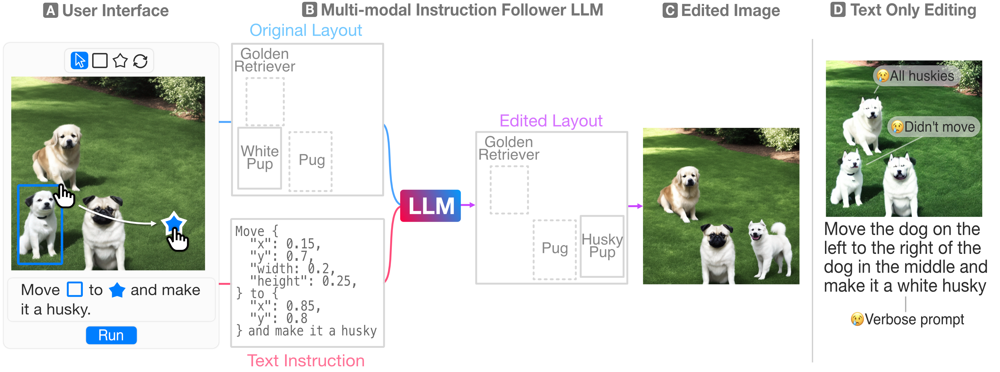

# ClickDiffusion: Harnessing LLMs for Interactive Precise Image Editing



Check out the paper [here](https://arxiv.org/abs/2404.04376).

Recently, researchers have proposed powerful systems for generating and manipulating images using natural language instructions. However, it is difficult to precisely specify many common classes of image transformations with text alone. For example, a user may wish to change the location and breed of a particular dog in an image with several similar dogs. This task is quite difficult with natural language alone, and would require a user to write a laboriously complex prompt that both disambiguates the target dog and describes the destination. We propose ClickDiffusion, a system for precise image manipulation and generation that combines natural language instructions with visual feedback provided by the user through a direct manipulation interface. We demonstrate that by serializing both an image and a multi-modal instruction into a textual representation it is possible to leverage LLMs to perform precise transformations of the layout and appearance of an image. 

# Run the Demo UI Locally
## Installation 
### Install locally as a pip package

Create a conda environment 

```
$ conda env create -f environment.yml
```   

activate it 

```
$ conda activate clickdiffusion
```

### Install Node.js Dependencies

```
$ cd clickdiffusion/demo/react_frontend
$ npm install
```

## Run the demonstration

Run the following commands to set up the frontend and backend. Change ports as needed.
You will need to run these in two separate terminals. 

### Run the backend

```
$ cd clickdiffusion/demo/fast_api
$ API_KEY="OPEN_AI_KEY_HERE" uvicorn main:app --reload --port 8889
```

## Run the frontend React server

```
$ cd clickdiffusion/demo/react_frontend
$ REACT_APP_BACKEND_PORT=8889 npm start
```
